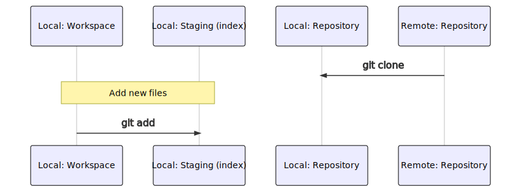
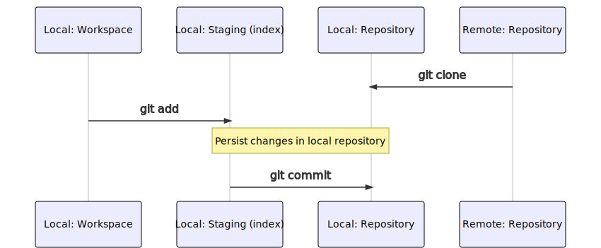
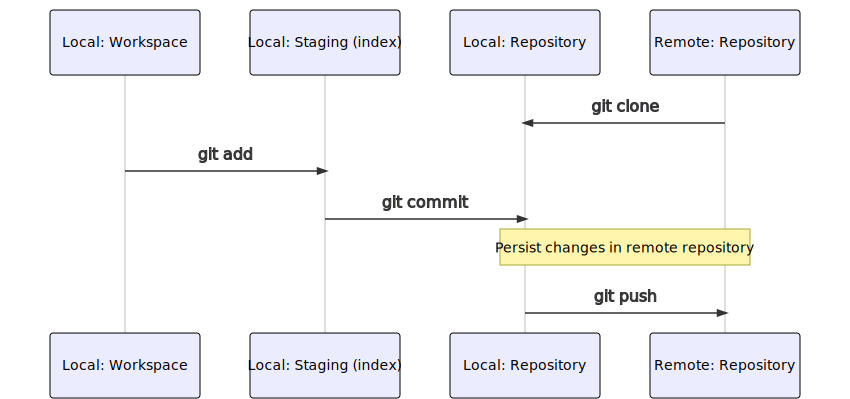

### Lab: Add a file

<!-- .slide: class="is-lab" -->

---

## Git add



<!-- ``` mermaid
sequenceDiagram
    participant lw as Local: Workspace
    participant ls  as Local: Staging (index)
    participant lr as Local: Repository
    participant rr as Remote: Repository
    #Note over rr,lr: Create a copy of an remote repository
    rr->>lr: git clone
    #Note over lw,lr: Switch to another branch on local workspace
    #lr->>lw: git checkout
    Note over lw,ls: A new files
    lw->>ls: git add
    #Note over ls,lr: Persist changes in local repository
    #ls->>lr: git commit
    #Note over lr,rr: Persist changes in remote repository
    #lr->>rr: git push
    #Note over lr,rr: Update latest changes from remote repository
    #rr->>lr: git fetch
    #Note over lw,rr: Update latest changes from remote repository & Apply on local repository
    #rr->>lw: git pull
``` -->

---

## Git add commands

Add all changed files to staging
```
git add .
```

Add specific file to staging
```
git add <file>
```

---

## Git status commands

Show changes between local workspace and staging
```
git status
```

Show changes between local workspace and staging - file overview only
```
git status -s
```

---

## Create a file

- Create a file `MyWebSite/spec/MyNewFeature.feature` with contents
    ``` feature
    Feature: Title of this cool feature 
    ```

- Verify that Git is not yet tracking the file, by executing in the workspace command prompt: 

    ``` 
    git status
    ```

- It should say: 

    ```
    On branch master 

    Your branch is up to date with 'origin/master'. 

    Untracked files: 
        (use "git add <file>..." to include in what will be committed) 

            MyWebSite/spec/MyNewFeature.feature
    ```

---

## Add file to Staging

- We have to add the file to the next commit: 

    ```
    git add .
    ```

- Verify that Git is now tracking the file, by executing in the workspace command prompt: 

    ```
    git status
    ```

- It should say: 

    ```
    On branch master 

    Your branch is up to date with 'origin/master'. 

    Changes to be committed: 

    (use "git reset HEAD <file>..." to unstage) 

            new file: MyWebSite/spec/MyNewFeature.feature
    ```

---

## Git commit



<!-- ``` mermaid
sequenceDiagram
    participant lw as Local: Workspace
    participant ls  as Local: Staging (index)
    participant lr as Local: Repository
    participant rr as Remote: Repository
    #Note over rr,lr: Create a copy of an remote repository
    rr->>lr: git clone
    #Note over lw,lr: Switch to another branch on local workspace
    #lr->>lw: git checkout
    #Note over lw,ls: A new files
    lw->>ls: git add
    Note over ls,lr: Persist changes in local repository
    #ls->>lr: git commit
    #Note over lr,rr: Persist changes in remote repository
    #lr->>rr: git push
    #Note over lr,rr: Update latest changes from remote repository
    #rr->>lr: git fetch
    #Note over lw,rr: Update latest changes from remote repository & Apply on local repository
    #rr->>lw: git pull
``` -->

---

## Git commit commands

Commit changes to local repository with message. When you don't use -m you get a local text add to fill in the message.
```
git commit -m 'Commit message'
```

Commit all changes in local workspace to local repository (git add + git commit)
```
git commit -a 
```

---

## Commit changes to local repository

- All files that have been added can now be committed. Each commit has to have a Commit Message that specifies what has been changed in this commit. 

    ```
    git commit -m "MyNewFeature file added"
    ```

- Verify that the change(s) has been committed locally: 

    ```
    git status
    ```
 
- It should say: 

    ```
    On branch master
    Your branch is ahead of 'origin/master' by 1 commit.
    (use "git push" to publish your local commits)

    nothing to commit, working tree clean
    ```

---

## Git push



<!-- ``` mermaid
sequenceDiagram
    participant lw as Local: Workspace
    participant ls  as Local: Staging (index)
    participant lr as Local: Repository
    participant rr as Remote: Repository
    #Note over rr,lr: Create a copy of an remote repository
    rr->>lr: git clone
    #Note over lw,lr: Switch to another branch on local workspace
    #lr->>lw: git checkout
    #Note over lw,ls: A new files
    lw->>ls: git add
    #Note over ls,lr: Persist changes in local repository
    ls->>lr: git commit
    Note over lr,rr: Persist changes in remote repository
    lr->>rr: git push
    #Note over lr,rr: Update latest changes from remote repository
    #rr->>lr: git fetch
    #Note over lw,rr: Update latest changes from remote repository & Apply on local repository
    #rr->>lw: git pull
``` -->

---

## Git push commands

Push all commits on local repository to the remote repository
```
git push
```

---

## Git log commands

Show list of all the commits in local repositoy and *known* from remote repository
```
git log
```

Same as above but in a nice list
```
git log --pretty=oneline
```

---
## Push changes to remote repository

- After making one or many changes (read: commits) locally, you can push all changes to the central repository (called origin/master or origin/main): 

    ```
    git push 
    ```
 

- Verify that the change(s) has been pushed:

    ```
    git status
    ```

- It should say: 

    ```
    On branch master 

    Your branch is up to date with 'origin/master'. 

    nothing to commit, working tree clean
    ```

- Show a list of all commits
  
    ```
    git log --pretty=oneline
    ```

---

## Lab checklist

- Add new file to local repository ✅
- Push changes to remote respository ✅