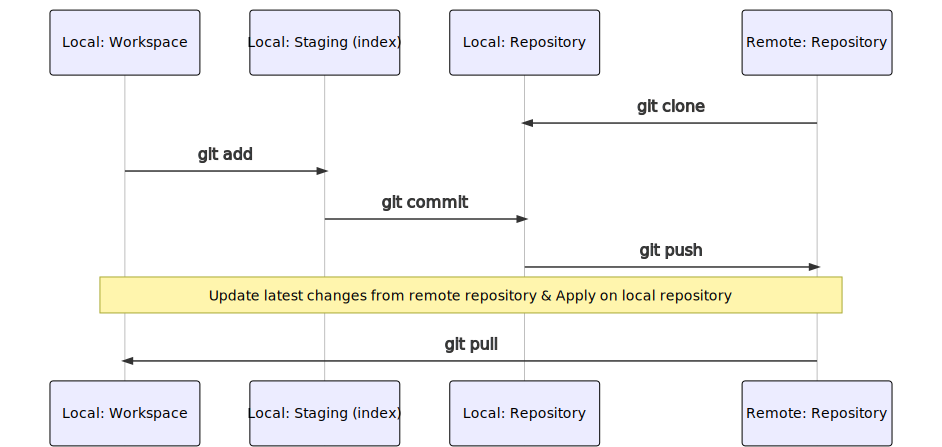

### Lab: Changing files

<!-- .slide: class="is-lab" -->

---

## Git pull



<!-- ``` mermaid
sequenceDiagram
    participant lw as Local: Workspace
    participant ls  as Local: Staging (index)
    participant lr as Local: Repository
    participant rr as Remote: Repository
    #Note over rr,lr: Create a copy of an remote repository
    rr->>lr: git clone
    #Note over lw,lr: Switch to another branch on local workspace
    #lr->>lw: git checkout
    #Note over lw,ls: A new files
    lw->>ls: git add
    #Note over ls,lr: Persist changes in local repository
    ls->>lr: git commit
    #Note over lr,rr: Persist changes in remote repository
    lr->>rr: git push
    #Note over lr,rr: Update latest changes from remote repository
    #rr->>lr: git fetch
    Note over lw,rr: Update latest changes from remote repository & Apply on local repository
    rr->>lw: git pull
``` -->

---

## Git pull commands

Update latest changes from remote repository & Apply on local repository
```
git pull
```

---

## Lab: Changing files

When we would like to make changes to a file in the repository, we take 5 steps: 

1. Make sure we have the latest version of the file(git pull) 
2. Make changes to the file `MyWebSite/spec/MyNewFeature.feature`
3. Add it locally(git add -A) 
4. Commit it locally(git commit -m "...") 
5. Push it to the repository(git push)

---

### Make sure we have the latest version of the file

- We pull the latest update from the central repository, just to be sure. In this case nothing has changed, since we are the only one who is working on this repository: 

    ```
    git pull 
    ```

---
 
### Make changes to the file 

- In `MyWebSite/spec/MyNewFeature.feature`, we add a narrative: 

    ```
    Feature: Title of this cool feature 

    In order to perform my task 
    as a user 
    I want to be helped in a cool way 
    ```
 
- Save the file

- Verify that Git has not yet staged the changes (i.e. they are not included in a commit): 

    ```
    git status
    ```
 
---

### Add it locally 

- We have to add the file to the next commit: 

    ```
    git add .
    ```

- Optionally, verify that Git is now tracking the file: 

    ```
    git status -s
    ```
 
---

### Commit it locally 

- All files that have been changed (or added) can now be committed. Each commit has to have a Commit Message that specifies what has been changed in this commit. 

```
git commit -m "Narrative added for MyNewFeature" 
```

- Optinally, verify that the change now has been committed locally: 

    ```
    git status -s
    ```

---

### Push it to the repository 

- After making commiting the change locally, you can push it to master: 

    ```
    git push 
    ```
 
- Verify that the change(s) has been pushed: 

    ```
    git log --pretty=oneline
    ```

---

## Lab checklist

- Modify files in local repository ✅
- Push changes to remote respository ✅