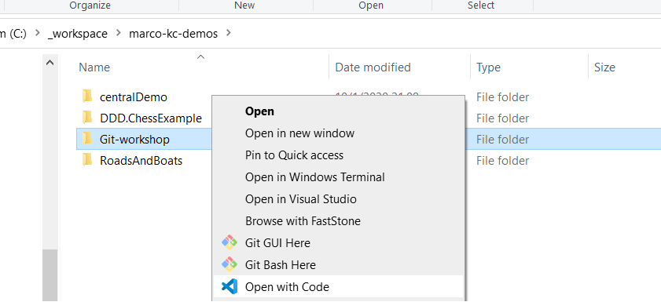

### Lab: Use git with Visual Studio Code

<!-- .slide: class="is-lab" -->

---

## Lab: Use git with Visual Studio Code

When we would like to make changes to a file in the repository, we take 4 steps: 

1. Checkout repository with Visual Studio Code
2. Edit a file locally with Visual Studio Code
3. Commit changes with Visual Studio Code
4. Push changes with Visual Studio Code

---

### Open Visual Studio Code

- Open visual studio code

  ```
  code .
  ```

  or


  

---

## Lab checklist

- Checkout repository with Visual Studio Code ✅
- Edit a file locally with Visual Studio Code ✅
- Commit changes with Visual Studio Code ✅
- Push changes with Visual Studio Code ✅